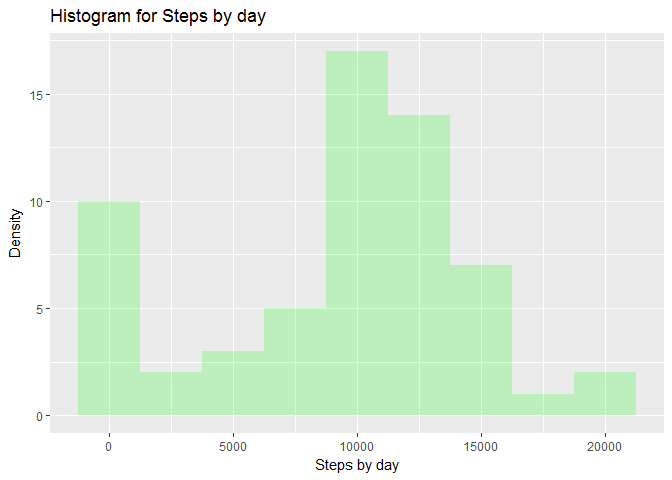
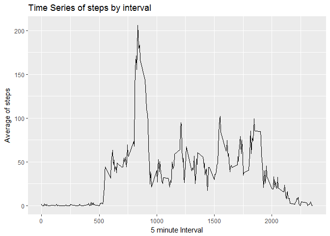
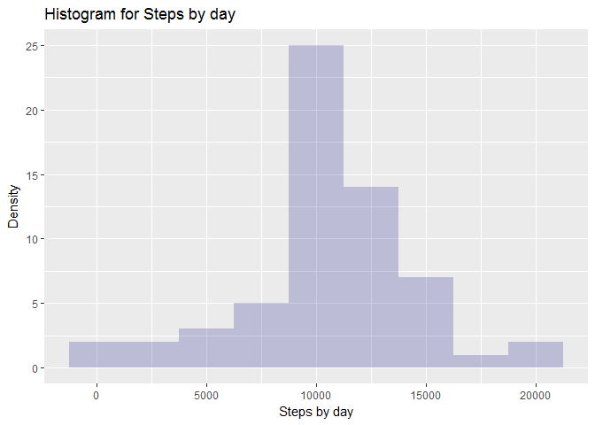
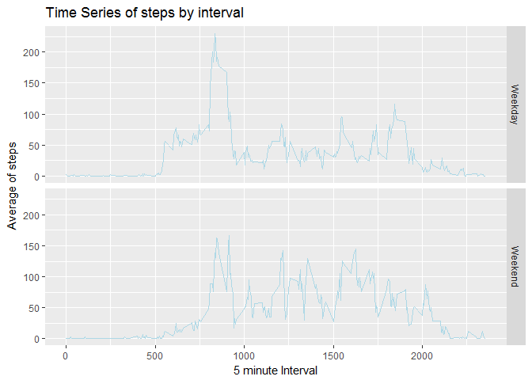

```r
#Initial preferences. All the code must be shown
knitr::opts_chunk$set(echo = TRUE )
#Libraries used
require(dplyr)
require(ggplot2)
```
## Loading and preprocessing the data

```r
#Downloading and unziping the file with the data
download.file(
        "https://d396qusza40orc.cloudfront.net/repdata%2Fdata%2Factivity.zip",
        "activity.zip"
        )
        unzip("activity.zip")
        #Loading the data
        activity = read.csv("activity.csv", stringsAsFactors = F)
        activity$date = as.Date(activity$date)
```
Checking the dataset has the right number of records and desired format

```r
dim(activity)
```

```
## [1] 17568     3
```

```r
head(activity)
```

```
##   steps       date interval
## 1    NA 2012-10-01        0
## 2    NA 2012-10-01        5
## 3    NA 2012-10-01       10
## 4    NA 2012-10-01       15
## 5    NA 2012-10-01       20
## 6    NA 2012-10-01       25
```
Creating a dataset with one record per day and the sum of the steps taken that day skipping NAs. It is used for answering first question

```r
# Grouping the activity by date, summing it up in one column
activityByDay = activity %>% group_by(date) %>% summarise(totalSteps = sum(steps, na.rm = T))
head(activityByDay)
```

```
## # A tibble: 6 x 2
##   date       totalSteps
##   <date>          <int>
## 1 2012-10-01          0
## 2 2012-10-02        126
## 3 2012-10-03      11352
## 4 2012-10-04      12116
## 5 2012-10-05      13294
## 6 2012-10-06      15420
```
Creating a dataset with one record per interval and the average of the steps taken in that interval skipping NAs. It is used for answering second question

```r
# Grouping the activity by date, averaging it up in one column
activityByInterval = activity %>% group_by(interval) %>% summarise(avgSteps = mean(steps, na.rm = T))
head(activityByInterval)
```

```
## # A tibble: 6 x 2
##   interval avgSteps
##      <int>    <dbl>
## 1        0   1.72  
## 2        5   0.340 
## 3       10   0.132 
## 4       15   0.151 
## 5       20   0.0755
## 6       25   2.09
```
## What is mean total number of steps taken per day?
For this part of the assignment, I ignore the missing values in the dataset.  

### 1. Make a histogram of the total number of steps taken each day

```r
# Setting bar width to 2500 for a better look
ggplot(data = activityByDay, aes(activityByDay$totalSteps)) +
        geom_histogram(binwidth = 2500,
        fill = "green",
        alpha = .2) +
        labs(title = "Histogram for Steps by day", x = "Steps by day", y = "Density")
```

<!-- -->

### 2.Calculate and report the mean and median total number of steps taken per day
- Obtaining the mean

```r
mean(activityByDay$totalSteps, na.rm = T)
```

```
## [1] 9354.23
```

- Obtaining the median

```r
median(activityByDay$totalSteps, na.rm = T)
```

```
## [1] 10395
```

## What is the average daily activity pattern?

### 1.Make a time series plot (i.e. type = "l") of the 5-minute interval (x-axis) and the average number of steps taken, averaged across all days (y-axis)

```r
ggplot(data = activityByInterval, aes(interval, avgSteps)) +
        geom_line() +
        labs(title = "Time Series of steps by interval", x = "5 minute Interval", y =
        "Average of steps")
```

<!-- -->

### 2. Which 5-minute interval, on average across all the days in the dataset, contains the maximum number of steps?

```r
subset(activityByInterval,avgSteps==max(activityByInterval$avgSteps, na.rm = T))$interval
```

```
## [1] 835
```
## Imputing missing values
Note that there are a number of days/intervals where there are missing values (coded as NA). The presence of missing days may introduce bias into some calculations or summaries of the data.

### 1. Calculate and report the total number of missing values in the dataset (i.e. the total number of rows with NAs)

```r
# Getting vector of rows with steps as NA. Later it will be used
rowsNAs = which(is.na(activity$steps))
length(rowsNAs)
```

```
## [1] 2304
```
### 2. Devise a strategy for filling in all of the missing values in the dataset. The strategy does not need to be sophisticated. For example, you could use the mean/median for that day, or the mean for that 5-minute interval, etc.
I have decided to take the 5-minute interval average stored in the dataset used to answer the second question. That value will be replace the NA on main dataset.

### 3. Create a new dataset that is equal to the original dataset but with the missing data filled in.

```r
# Initializing new dataset with the information of the old one
activityNoNas = activity
# Moving through the vector of rows with NAs
for (index in rowsNAs) {
# Assigning the value of the average of that interval
activityNoNas[index, "steps"] = subset(activityByInterval, interval == activityNoNas[index, "interval"])$avgSteps
}
```
Checking that the new dataset has the right number of records and desired format

```r
dim(activityNoNas)
```

```
## [1] 17568     3
```

```r
head(activityNoNas)
```

```
##       steps       date interval
## 1 1.7169811 2012-10-01        0
## 2 0.3396226 2012-10-01        5
## 3 0.1320755 2012-10-01       10
## 4 0.1509434 2012-10-01       15
## 5 0.0754717 2012-10-01       20
## 6 2.0943396 2012-10-01       25
```

### 4. Make a histogram of the total number of steps taken each day and Calculate and report the mean and median total number of steps taken per day
Creating a dataset with one record per day and the sum of the steps taken that day

```r
# Grouping the activity by date, summing it up in one column
activityByDayNoNas = activityNoNas %>% group_by(date) %>% summarise(totalSteps = sum(steps))
head(activityByDayNoNas)
```

```
## # A tibble: 6 x 2
##   date       totalSteps
##   <date>          <dbl>
## 1 2012-10-01     10766.
## 2 2012-10-02       126 
## 3 2012-10-03     11352 
## 4 2012-10-04     12116 
## 5 2012-10-05     13294 
## 6 2012-10-06     15420
```
Plotting the Histogram

```r
# Setting bar width to 2500 for a better look
ggplot(data = activityByDayNoNas, aes(activityByDayNoNas$totalSteps)) +
        geom_histogram(binwidth = 2500,
        fill = "NavyBlue",
        alpha = .2) +
        labs(title = "Histogram for Steps by day", x = "Steps by day", y = "Density")
```

<!-- -->
- Obtaining the mean

```r
mean(activityByDayNoNas$totalSteps)
```

```
## [1] 10766.19
```
- Difference with the previous mean

```r
mean(activityByDayNoNas$totalSteps) - mean(activityByDay$totalSteps, na.rm =T)
```

```
## [1] 1411.959
```
- Obtaining the median

```r
median(activityByDayNoNas$totalSteps)
```

```
## [1] 10766.19
```
- Difference with the previous median

```r
median(activityByDayNoNas$totalSteps) - median(activityByDay$totalSteps, na.rm =T)
```

```
## [1] 371.1887
```
Do these values differ from the estimates from the first part of the assignment? 

- Yes both meassures have been increased  

What is the impact of imputing missing data on the estimates of the total daily number of steps?

- It increases the total number, specially in the lower quantiles


## Are there differences in activity patterns between weekdays and weekends?
 Using the dataset with the filled-in missing values for this part.

### 1. Create a new factor variable in the dataset with two levels -- "weekday" and "weekend" indicating whether a given date is a weekday or weekend day.

```r
# Changing regional settings
Sys.setlocale("LC_ALL", "English")
```

```
## [1] "LC_COLLATE=English_United States.1252;LC_CTYPE=English_United States.1252;LC_MONETARY=English_United States.1252;LC_NUMERIC=C;LC_TIME=English_United States.1252"
```

```r
# Vector of weekend days
weekend = c("Saturday", "Sunday")
# Creating factor column
activityNoNas$weekday = as.factor(ifelse(
weekdays(activityNoNas$date) %in% weekend,
'Weekend',
'Weekday'
))
#Checking the variable is well constructed and added to the dataset
head(activityNoNas)
```

```
##       steps       date interval weekday
## 1 1.7169811 2012-10-01        0 Weekday
## 2 0.3396226 2012-10-01        5 Weekday
## 3 0.1320755 2012-10-01       10 Weekday
## 4 0.1509434 2012-10-01       15 Weekday
## 5 0.0754717 2012-10-01       20 Weekday
## 6 2.0943396 2012-10-01       25 Weekday
```

```r
str(activityNoNas$weekday)
```

```
##  Factor w/ 2 levels "Weekday","Weekend": 1 1 1 1 1 1 1 1 1 1 ...
```

### 2. Make a panel plot containing a time series plot (i.e. type = "l") of the 5-minute interval (x-axis) and the average number of steps taken, averaged across all weekday days or weekend days (y-axis).

First, a new dataset is created with the averages of every 5 minute interval. It's based on the previous dataset with the weekday factor variable.

```r
# Grouping the activity by date, averaging it up in one column
activityByIntervalNoNAs = activityNoNas %>% group_by(interval, weekday) %>% summarise(avgSteps = mean(steps, na.rm = T))
head(activityByIntervalNoNAs)
```

```
## # A tibble: 6 x 3
## # Groups:   interval [3]
##   interval weekday avgSteps
##      <int> <fct>      <dbl>
## 1        0 Weekday   2.25  
## 2        0 Weekend   0.215 
## 3        5 Weekday   0.445 
## 4        5 Weekend   0.0425
## 5       10 Weekday   0.173 
## 6       10 Weekend   0.0165
```
Finally, the plot with the new dataset is done

```r
ggplot(data = activityByIntervalNoNAs, aes(interval, avgSteps)) +
        geom_line(color="LightBlue") +
        labs(title = "Time Series of steps by interval", x = "5 minute Interval", y =
        "Average of steps") + facet_grid( weekday ~ .)
```

<!-- -->
